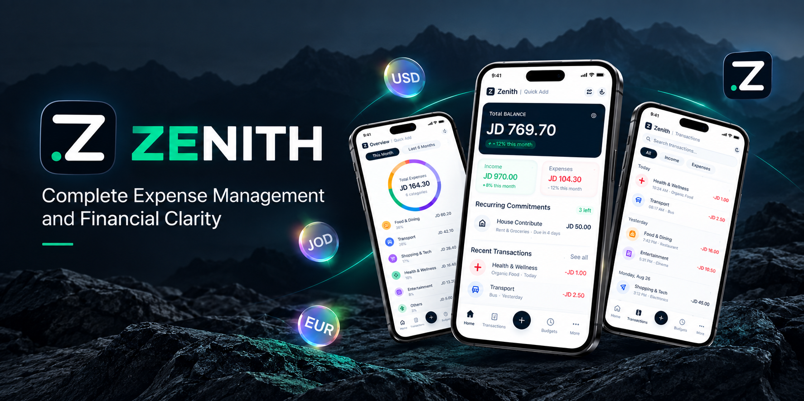

# Zenith

<p align="center">
  
</p>

<p align="center">
  <b>A private, high-velocity personal financial ledger built with Expo SDK 57, React Native Reanimated 4, and local SQLite.</b>
</p>

<p align="center">
  
  
  
  
  
  
  
  
</p>

---

## Overview

Zenith is a minimalist, local-first financial ledger designed for clarity and speed. It strips away banking bureaucracy, account aggregation, subscription paywalls, and telemetry in favor of pure financial velocity: tracking what comes in and what goes out with zero cognitive overhead.

All records are stored directly on your device inside an embedded SQLite database. Your financial data never touches an external server.

> **Engineering Deep Dive**: Explore the comprehensive [Architecture & Engineering Guide](./learn/README.md) to understand how each subsystem is built from first principles.

---

## Key Features

### 1. Pure Red & Green Cash Velocity Ledger
- High-contrast visual hierarchy: Crimson Red (`#EF4444`) for outflows and Emerald Green (`#10B981`) for inflows across every card, chart, and metric.
- Direct decimal entry using the device native numeric keypad for frictionless logging.
- Categorized outflows with a 2-column ergonomic grid and custom category creation.
- Payment method tagging (Card or Cash) contextualized specifically for expense records.

### 2. Payday-Aligned Salary Cycle Engine
- Custom cycle configuration (e.g., 27th to 26th) to measure spending against real pay schedules rather than arbitrary calendar months.
- Calendar math engine accounting for 28, 29, 30, and 31-day months, leap years, and cross-year cycles.
- Flanked period stepper controls (`<` and `>`) with a 1-tap `Today` reset pill to navigate past and future periods.
- Live countdown indicating remaining days until the next payday.

### 3. Recurring Bills & Subscriptions Manager
- Centralized tracking for rent, streaming services, utility commitments, and loan payments.
- Real-time cycle status detection: Paid in Cycle, Due Today, Overdue, and Upcoming.
- Tactile 1-tap `Log` button that posts bill payments straight to the ledger with automatic duplicate prevention.
- Cycle commitment summary displaying total monthly liabilities, paid obligations, and remaining debt.

### 4. Data Backup & Disaster Recovery
- Full local snapshot creation with portable JSON export.
- Seamless distribution via native OS share sheet (iOS/Android), local file downloads (Web), or system clipboard.
- Dual restoration modes:
  - **Merge**: Safely appends missing transactions and bills with newly generated unique IDs.
  - **Overwrite**: Cleanly resets and replaces database tables with validated backup payloads.
- Strict payload schema validation with verification checks against corrupt or tampered files.

### 5. Instant Multi-Currency Recalculation
- Multi-currency ledger support (JOD, USD, EUR, GBP, AED, SAR, and more).
- Real-time rate recalculation across all historical transactions when toggling display currency without mutating stored base values.
- Local persistence of selected currency, salary payday, and privacy preferences.

### 6. Analytics & Financial Statements
- Interactive SVG donut chart detailing proportional category distributions.
- Weekly spending velocity bar charts highlighting outflow distribution.
- Net savings rate banner and retained capital tracking.
- Standard RFC 4180-compliant CSV statement export via native share sheets.

### 7. Ultra-Lean 34 MB Standalone APK
- Reduced release APK footprint from 117 MB down to **34.36 MB** (-70%).
- Targeted ABI architecture (`arm64-v8a`) preventing uncompressed cross-architecture bloat.
- Android R8 code shrinking, resource shrinking, and dead-code stripping enabled.
- Direct vector icon tree-shaking eliminating bundled unused font packs.

---

## Comparison

| Feature | Traditional Finance Apps | Spreadsheets | Zenith |
| :--- | :--- | :--- | :--- |
| **Data Privacy** | Cloud servers, analytics, telemetry | Local or cloud | 100% Local SQLite (Zero telemetry) |
| **Bank Account Linking** | Mandatory / third-party scrapers | Manual | None (Full manual control) |
| **Payday Cycles** | Rarely supported (Calendar month only) | Complex custom formulas | Native custom salary day cycle |
| **Recurring Bills** | Hidden behind subscriptions | Manual entry | 1-tap quick log with deduplication |
| **Offline Support** | Limited or non-existent | Depends on host app | Full offline capability |
| **Export / Portability** | Proprietary or restricted | CSV / XLSX | Clean JSON backup & RFC 4180 CSV |
| **App Footprint** | 100 MB+ with constant network sync | Varies | 34.36 MB optimized native binary |

---

## Technical Stack

| Domain | Technology |
| :--- | :--- |
| **Framework** | Expo SDK 57 (React Native 0.86, React 19) |
| **Routing** | Expo Router (File-based navigation) |
| **Database** | `expo-sqlite` with WAL mode |
| **Animations** | React Native Reanimated 4.5 & React Native Worklets |
| **File Operations** | `expo-file-system`, `expo-sharing`, `expo-document-picker` |
| **Haptics** | `expo-haptics` |
| **Vector Icons** | `@expo/vector-icons/Feather` (Tree-shaken) |
| **Build Optimization** | `expo-build-properties` (R8 shrinking, ABI filtering) |
| **Test Suite** | Node.js native test runner with custom ESM/TS mock loader |

---

## Project Structure

```
Zenith/
├── assets/
│   └── images/                   # App icon, splash screen, and showcase assets
├── learn/                        # Architecture & engineering guides
│   ├── README.md                 # System overview & learning roadmap
│   └── 01-07-*.md                # Deep-dive modules (SQLite, Payday engine, APK diet)
├── src/
│   ├── app/                      # Expo Router file-based screens
│   │   ├── _layout.tsx           # Global providers (Theme, SQLite, SafeArea)
│   │   ├── index.tsx             # Root redirect
│   │   └── (tabs)/
│   │       ├── _layout.tsx       # Bottom tabs navigation wrapper
│   │       ├── index.tsx         # Dashboard, Cash Flow Matrix, Recurring Widget
│   │       ├── transactions.tsx  # Transaction Ledger, Search, and Filters
│   │       ├── quick-add.tsx     # Quick Add with Native Keypad
│   │       └── analytics.tsx     # Donut Chart, Commitments, Backup, and Version
│   ├── components/               # Modals, widgets, headers, and UI components
│   ├── context/                  # ThemeContext & TransactionContext
│   ├── db/                       # SQLite schema, migrations, and CRUD operations
│   ├── theme/                    # Semantic tokens, typography, and palettes
│   └── utils/                    # Salary cycle engine, backup validation, formatters
├── tests/                        # Automated unit and integration test suites
├── app.json                      # Expo application manifest
├── eas.json                      # EAS build configurations
└── package.json
```

---

## Getting Started

### Prerequisites
- Node.js 18.x or newer
- npm or yarn

### Installation
```bash
# Clone the repository
git clone https://github.com/KHOJAH/Zenith.git
cd Zenith

# Install dependencies
npm install

# Start the Expo development server
npx expo start
```

### Running Tests
Execute the automated test suite covering backup validation, date interval transitions, and recurring bills business logic:

```bash
node --loader ./scripts/test-loader.mjs --test ./tests/backup.test.mjs ./tests/dateInterval.test.mjs ./tests/recurring.test.mjs ./tests/recurring-db.test.mjs
```

---

## Building Standalone APK

### Local Release Build (Android)
Requires Android Studio, Android SDK, and Java JDK 17+.

```powershell
# Prebuild native project files
npx expo prebuild -p android

# Generate release APK
cd android
.\gradlew assembleRelease
```
The output binary will be located at:
`android/app/build/outputs/apk/release/app-release.apk`

### EAS Cloud Build
```bash
# Log in to Expo
npx eas-cli login

# Initiate preview APK build
npx eas-cli build -p android --profile preview
```

---

## Release Notes — Version 1.0.1

- Recurring bills and subscriptions manager with 1-tap quick logging.
- Offline data backup and recovery system with JSON export and import.
- Dual restore modes supporting non-destructive merge and full overwrite.
- Interactive period navigation stepper with previous, next, and current cycle controls.
- Optimized release APK binary footprint reduced from 117 MB to 34.36 MB.
- Visible version indicator added to the analytics settings interface.
- Complete automated test coverage with 66 passing unit and integration tests.

---

## Privacy & Security

Zenith operates strictly on an offline-first model. No personal information, spending habits, transaction amounts, or device identifiers are collected, tracked, or transmitted. All data resides exclusively on the physical device in a local SQLite file.

---

## License

This project is licensed under the MIT License.
