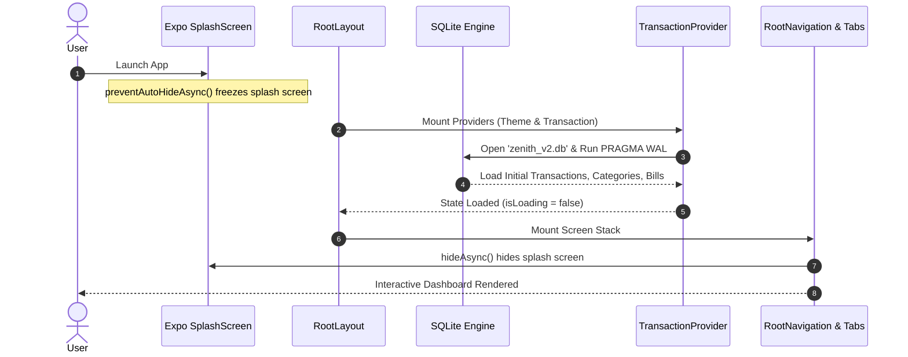
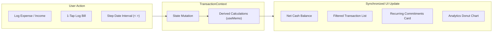

# 01. App Architecture & State Flow

This module explains how Zenith initializes, how screens are routed, and how reactive data flows throughout the app.

---

## 1. The Application Bootstrap Lifecycle

Zenith launches through Expo Router's root entry point located at [`src/app/_layout.tsx`](file:///c:/Zenith/src/app/_layout.tsx).

Before any UI renders, the app coordinates initialization:



### Preventing White Flashes
To prevent layout shifts and flickering un-themed UI, [`src/app/_layout.tsx`](file:///c:/Zenith/src/app/_layout.tsx) invokes:
```typescript
import * as SplashScreen from 'expo-splash-screen';

// Prevents splash screen from auto-dismissing before DB & themes hydrate
SplashScreen.preventAutoHideAsync().catch(() => {});
```
Once [`RootNavigation`](file:///c:/Zenith/src/app/_layout.tsx#L12-L27) mounts and detects theme readiness, it signals `SplashScreen.hideAsync()`.

---

## 2. Provider Hierarchy

Zenith nests its providers strictly in order of functional dependence:

```tsx
export default function RootLayout() {
  return (
    <GestureHandlerRootView style={{ flex: 1 }}>
      <SafeAreaProvider>
        <ThemeProvider>
          <TransactionProvider>
            <RootNavigation />
          </TransactionProvider>
        </ThemeProvider>
      </SafeAreaProvider>
    </GestureHandlerRootView>
  );
}
```

1. **`GestureHandlerRootView`**: Required by `react-native-gesture-handler` and `react-native-reanimated` 4.x for handling spring gestures, sheet pans, and tactile swipes on native threads.
2. **`SafeAreaProvider`**: Calculates hardware device insets (notches, dynamic islands, home indicator bars).
3. **`ThemeProvider`** ([`src/context/ThemeContext.tsx`](file:///c:/Zenith/src/context/ThemeContext.tsx)): Injects dark/light color tokens (`isDark`), system appearance listeners, and manual theme toggles.
4. **`TransactionProvider`** ([`src/context/TransactionContext.tsx`](file:///c:/Zenith/src/context/TransactionContext.tsx)): The master reactive state store powering ledger operations, calculations, recurring bills, and storage synchronization.

---

## 3. File-Based Routing with Expo Router

Zenith uses file-system-based routing under [`src/app/`](file:///c:/Zenith/src/app/):

```
src/app/
├── _layout.tsx         # Root application wrapper & providers
├── index.tsx           # Redirects to (tabs)
└── (tabs)/             # Tab route group
    ├── _layout.tsx     # Custom Zenith bottom navigation bar
    ├── index.tsx       # Tab 1: Dashboard & Cash Flow Matrix
    ├── transactions.tsx# Tab 2: Transaction Ledger, Search & Filters
    ├── quick-add.tsx   # Tab 3: Native Numpad Quick Entry
    └── analytics.tsx   # Tab 4: Donut Chart, Commitments & Settings
```

### Custom Navigation Bar
Rather than using standard iOS/Android tab icons, [`src/app/(tabs)/_layout.tsx`](file:///c:/Zenith/src/app/(tabs)/_layout.tsx) delegates rendering to [`src/components/ZenithTabBar.tsx`](file:///c:/Zenith/src/components/ZenithTabBar.tsx).
- Features floating haptic-responsive action pills.
- Center action (`quick-add`) is elevated for rapid one-thumb thumb access.
- Dynamic color transitions reacting to active route and theme tokens.

---

## 4. Reactive State & Unidirectional Data Flow

Zenith maintains a **single source of truth** inside [`TransactionContext`](file:///c:/Zenith/src/context/TransactionContext.tsx).



### Memoization Strategy
Because financial recalculations can become heavy with thousands of ledger entries, `TransactionContext` uses granular `useMemo` hooks:

1. **Analytics Calculation**:
   ```typescript
   const analytics = useMemo(() => {
     return calculateMonthAnalytics(transactions, dateInterval, currency);
   }, [transactions, dateInterval, currency]);
   ```
2. **Recurring Status Calculation**:
   ```typescript
   const recurringStatuses = useMemo(() => {
     return recurringBills.map(bill =>
       evaluateBillStatusInInterval(bill, dateInterval, transactions)
     );
   }, [recurringBills, dateInterval, transactions]);
   ```
3. **Commitments Summary**:
   ```typescript
   const recurringSummary = useMemo(() => {
     return calculateRecurringSummaries(recurringBills, dateInterval, transactions, currency);
   }, [recurringBills, dateInterval, transactions, currency]);
   ```

When a user switches interval from `< 27 Aug – 26 Sep >` to `< 27 Jul – 26 Aug >`, **only the memoized derivations recompute**, and all connected views update synchronously across the entire app.
