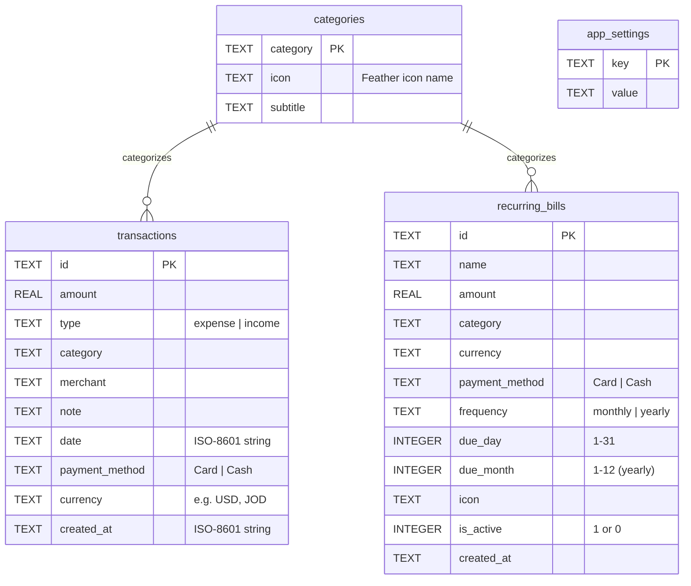
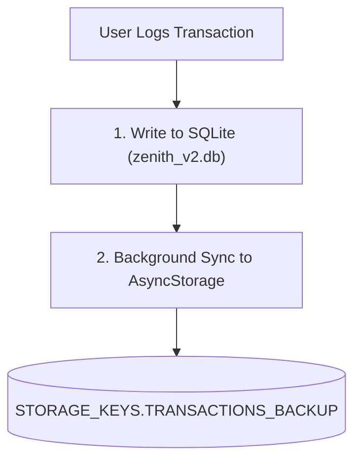

# 02. Database & Offline Storage

This module explores Zenith's persistence layer, covering SQLite architecture, write-ahead logging, database schema design, and our dual-storage resilience model.

---

## 1. Why Embedded SQLite?

Zenith rejects cloud storage and remote servers. All data lives on the user's physical device.
Instead of relying solely on key-value stores (`AsyncStorage`), Zenith uses an embedded **SQLite** relational engine via `expo-sqlite`:

| Feature | Key-Value Store (`AsyncStorage`) | Embedded SQLite (`expo-sqlite`) |
| :--- | :--- | :--- |
| **Query Flexibility** | Must parse entire JSON blob into RAM | Instant SQL filtering by date range & category |
| **Performance** | O(N) memory deserialization on every load | O(log N) indexed B-tree lookups |
| **ACID Guarantees** | Risk of corruption during app crash | Atomic transactions with rollback protection |
| **Write Concurrency** | Serial string overwrites | Concurrent reads and writes via WAL mode |

---

## 2. SQLite Engine Configuration & WAL Mode

Located in [`src/db/database.ts`](file:///c:/Zenith/src/db/database.ts), database initialization runs when the app boots:

```typescript
const db = await SQLite.openDatabaseAsync('zenith_v2.db');

await db.execAsync(`
  PRAGMA journal_mode = WAL;
`);
```

### What is WAL (Write-Ahead Logging)?
In traditional rollback journal mode, writing to the database locks the entire file, blocking reads until the write completes.
In **WAL mode**:
- Reads and writes happen concurrently without blocking each other.
- New writes append to a separate `-wal` log file.
- SQLite periodically checkpoints the WAL file back to the primary `zenith_v2.db` file.
- Greatly increases UI responsiveness during rapid transaction entries and prevents database locks during bulk imports.

---

## 3. Schema Design

The database contains four dedicated tables defined in [`src/db/database.ts`](file:///c:/Zenith/src/db/database.ts#L50-L88):



### Table Details:
1. **`transactions`**:
   - `amount`: Clean floating point value stored in the transaction's native currency.
   - `type`: Strict enum (`'expense' | 'income'`).
   - `date`: Formatted as ISO-8601 string (`YYYY-MM-DDTHH:mm:ss.sssZ`) allowing lexical sorting and interval range queries (`BETWEEN :start AND :end`).
   - `payment_method`: Strictly `'Card' | 'Cash'` for expenses, omitted for income.
2. **`categories`**:
   - Stores custom and default category names with their associated Feather icon token and subtitle.
3. **`recurring_bills`**:
   - Stores fixed recurring liabilities (subscriptions, rent, utilities) with their target due day (1–31) and frequency.
4. **`app_settings`**:
   - Key-value table for persistent user settings: `currency`, `salary_day`, `is_balance_hidden`.

---

## 4. Performance Indexing

To guarantee instantaneous queries even when a user has logged tens of thousands of transactions over several years, [`src/db/database.ts`](file:///c:/Zenith/src/db/database.ts#L91) builds a dedicated B-tree index on transaction dates:

```sql
CREATE INDEX IF NOT EXISTS idx_transactions_date ON transactions(date);
```

Whenever the dashboard filters transactions for a period (e.g. `2026-08-27` to `2026-09-26`), SQLite executes an indexed range scan in sub-millisecond time rather than a full table scan.

---

## 5. The Dual-Storage Resilience Model

Mobile operating systems occasionally clean temporary files or face unexpected process termination during updates.
To ensure absolute data durability, Zenith implements a **dual-storage safety model**:



1. **Primary**: All reads, writes, and real-time operations execute directly against SQLite.
2. **Secondary Shadow Backup**: Every successful SQLite write triggers a non-blocking asynchronous snapshot to `AsyncStorage` ([`src/utils/storage.ts`](file:///c:/Zenith/src/utils/storage.ts)).
3. **Automatic Fallback**: If SQLite ever encounters a corrupt database file upon device launch, Zenith detects the failure and offers an automatic restore from the secondary `AsyncStorage` shadow snapshot.
