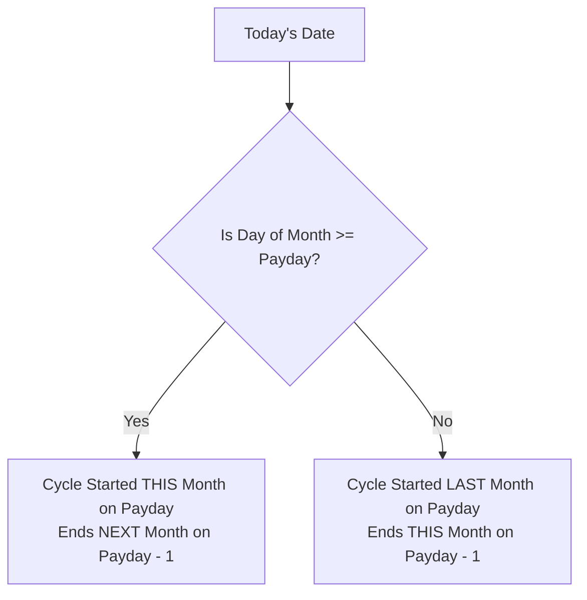
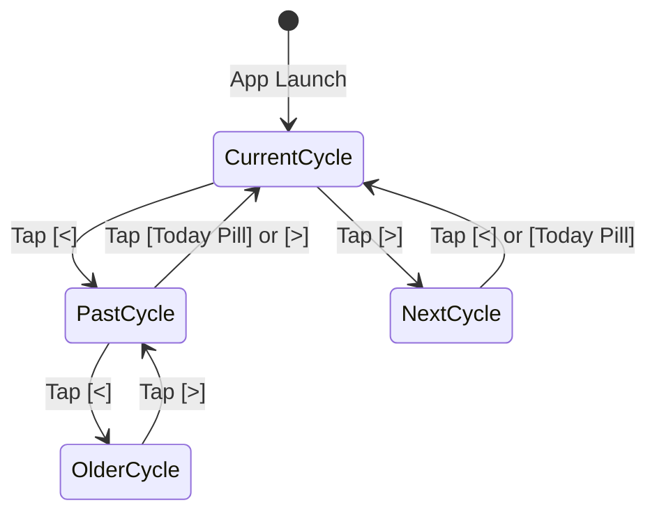

# 03. Salary Cycle Engine & Period Navigation

This module details how Zenith calculates salary periods, handles complex calendar edge cases (leap years and variable month lengths), and powers interactive period navigation.

---

## 1. Why Salary Cycles Instead of Calendar Months?

Most budgeting apps force users into rigid calendar months (e.g., August 1 – August 31).
However, the majority of employees receive their salaries on a specific recurring day—such as the **27th**.

If your salary arrives on August 27:
- The conventional calendar month lumps August 1–26 (funded by July's salary) with August 27–31 (funded by August's salary).
- This distorts spending velocity, distorts savings rates, and makes net cash balance misleading.

Zenith treats the **Salary Cycle** as the foundational accounting window:
$$\text{Current Cycle} = [\text{Payday of Month } M, \;\; \text{Payday} - 1 \text{ of Month } M+1]$$

For example, with payday set to the 27th:
- **Cycle Start**: `2026-08-27T00:00:00.000`
- **Cycle End**: `2026-09-26T23:59:59.999`

---

## 2. Deriving the Active Salary Cycle

Located in [`src/utils/salary.ts`](file:///c:/Zenith/src/utils/salary.ts#L4-L45) and [`src/utils/dateInterval.ts`](file:///c:/Zenith/src/utils/dateInterval.ts), the engine evaluates where the current reference date falls relative to payday:

### Calendar Normalization & Clamping
Different months have different numbers of days (28, 29, 30, 31). If a user sets their payday to **31**:
1. In April (30 days), the start day clamps to `30`.
2. In February (28 days, or 29 in leap years), the start day clamps to `28` (or `29`).
3. JavaScript's `new Date(year, month + 1, 0).getDate()` is used to dynamically detect the true last day of any target month.

---

## 3. Period Stepping Algorithm (`<` and `>`)

Zenith allows users to step back into past cycles to inspect historical cash flow, or look ahead into the upcoming cycle.

Located in [`src/utils/dateInterval.ts`](file:///c:/Zenith/src/utils/dateInterval.ts#L106-L230), the `stepDateInterval(interval, direction, salaryDay)` function handles transitions without date drift:

### Salary Cycle Stepping Math
To step backward from `27 Aug – 26 Sep`:
1. Parse the cycle start date (`start = new Date('2026-08-27')`).
2. If `direction === 'prev'`, subtract 1 month:
   $$\text{targetMonth} = \text{start.getMonth()} - 1$$
3. Re-calculate the cycle boundaries using `getSalaryCycleDates(salaryDay, targetDate)`.
4. Result: `27 Jul – 26 Aug`.

### Cross-Year Boundaries
When stepping backwards from `27 Jan 2026 – 26 Feb 2026`:
- Target month becomes `-1`, which rolls automatically to `December 2025`.
- Start: `27 Dec 2025`.
- End: `26 Jan 2026`.
- The formatted label correctly displays year transitions: `"27 Dec '25 – 26 Jan '26"`.

---

## 4. Boundary Protection & The "Today" Reset

### Future Boundary (`canStepNext`)
To prevent users from accidentally stepping endlessly into future empty years, [`canStepNext`](file:///c:/Zenith/src/utils/dateInterval.ts#L290-L335) enforces a maximum forward lookahead of **+1 cycle** beyond the current period.
- If the active view is already at `+1` cycle into the future, the `>` button dims and disables.

### 1-Tap "Today" Reset
Whenever the active interval is not the present period, Zenith exposes a quick-return mechanism:
- The UI displays a subtle `Today` indicator pill.
- Tapping it invokes `resetDateIntervalToCurrent()`, which instantly snaps the interval back to the present cycle.

---

## 5. Automated Verification

All calendar arithmetic, leap year logic, and boundary conditions are rigorously tested in [`tests/dateInterval.test.mjs`](file:///c:/Zenith/tests/dateInterval.test.mjs):
- Paydays 1 through 31 step roundtrip cleanly.
- February 29 leap years (2024, 2028) correctly handled.
- Variable month clamping tested across 28, 30, and 31-day transitions.
