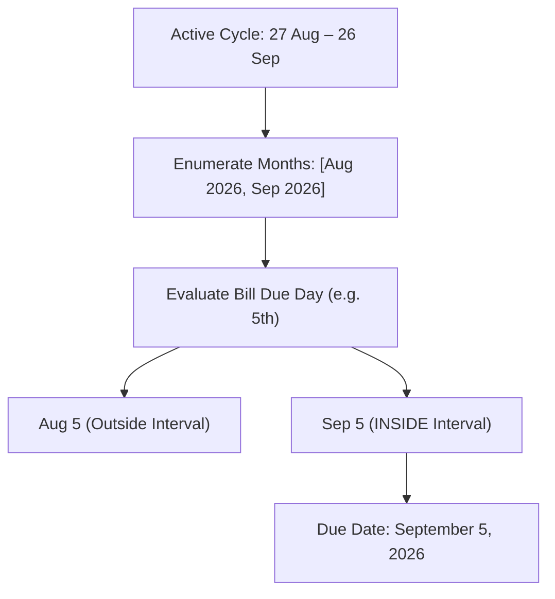
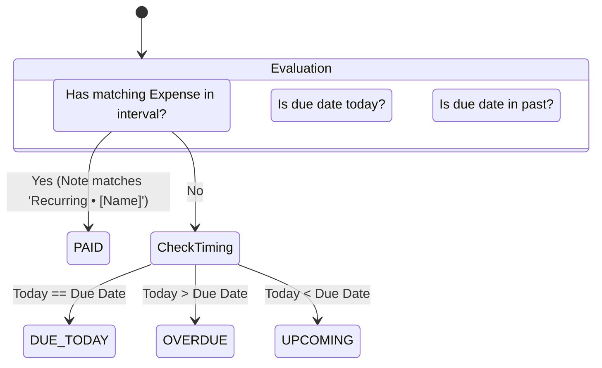

# 04. Recurring Bills & Subscriptions Manager

This module details how Zenith tracks fixed monthly/yearly commitments, projects due dates into active salary cycles, evaluates payment statuses, and enables 1-tap logging.

---

## 1. Why Separate Recurring Commitments from Transactions?

In many budget apps, recurring bills are either:
1. Pre-generated as fake future transactions that clutter the ledger and distort current cash balance.
2. Forgotten until the user manually logs them after receiving a bank notification.

Zenith uses a dedicated entity—[`RecurringBill`](file:///c:/Zenith/src/db/schema.ts#L40-L53)—stored in SQLite:
- Recurring commitments do **not** touch your net cash balance until they are explicitly paid.
- Instead, they sit in a dedicated monitoring state, calculating how much committed capital remains to be paid before your next payday.

---

## 2. Interval-Aware Due Date Projection

Because Zenith supports arbitrary salary cycles (e.g., `27 Aug` to `26 Sep`), a recurring bill's due day may fall into either the first or second calendar month spanned by the cycle.

Located in [`src/utils/recurring.ts`](file:///c:/Zenith/src/utils/recurring.ts#L29-L88), `getBillDueDateInInterval()` resolves the exact due date:



### Yearly Bills
For annual bills (e.g., Amazon Prime or Car Insurance), `due_month` is checked against the months included in the active cycle. If that month does not fall within the active cycle, `getBillDueDateInInterval()` returns `null`, and the bill is not displayed in the current cycle.

---

## 3. The 4-State Lifecycle Machine

Once a bill's due date is projected into the active cycle, Zenith compares it against the user's ledger and the current clock:



1. **`PAID`**:
   - Detected if any transaction in the active interval matches:
     - `note` equals `"Recurring • [bill.name]"` OR starts with `"Recurring • [bill.name]"`
     - OR `merchant` equals `bill.name` (case-insensitive)
     - Must be an **expense** (incomes are never treated as bill payments).
2. **`DUE_TODAY`**:
   - Not yet paid, and current date matches the projected due date.
3. **`OVERDUE`**:
   - Not yet paid, and current date has passed the projected due date.
4. **`UPCOMING`**:
   - Not yet paid, and projected due date is still in the future.

---

## 4. 1-Tap "Log" Payment Execution

When a bill becomes due, the user can tap the **`[ Log ]`** button on the [`UpcomingBillsWidget`](file:///c:/Zenith/src/components/UpcomingBillsWidget.tsx) located on the Dashboard.

Executing `logRecurringBillPayment(bill)` in [`TransactionContext.tsx`](file:///c:/Zenith/src/context/TransactionContext.tsx#L324-L352):
1. Creates a standard expense transaction:
   ```typescript
   {
     amount: bill.amount,
     type: 'expense',
     category: bill.category,
     merchant: bill.name,
     note: `Recurring • ${bill.name}`,
     payment_method: bill.payment_method,
     currency: bill.currency,
     date: dueDate.toISOString(),
   }
   ```
2. Atomically persists the record into SQLite.
3. Triggers haptic feedback (`Haptics.impactAsync`).
4. Instantly transitions the bill status to **`PAID`**.
5. Decrements `cycleRemaining` commitments and updates net cash balance.

---

## 5. Commitments Aggregation & Currency Normalization

Located in [`src/utils/recurring.ts`](file:///c:/Zenith/src/utils/recurring.ts#L160-L200), `calculateRecurringSummaries()` generates cycle metrics:

- **`totalMonthlyCommitment`**: Sum of all active monthly bills (+ yearly bills / 12), converted to the user's active display currency.
- **`cycleTotalCommitted`**: Sum of obligations with due dates inside this specific cycle.
- **`cyclePaid`**: Total amount already logged/paid in this cycle.
- **`cycleRemaining`**: Remaining amount to be paid before the cycle ends.

This data is rendered directly in the **Fixed Commitments** card on the Analytics screen ([`src/app/(tabs)/analytics.tsx`](file:///c:/Zenith/src/app/(tabs)/analytics.tsx)).
