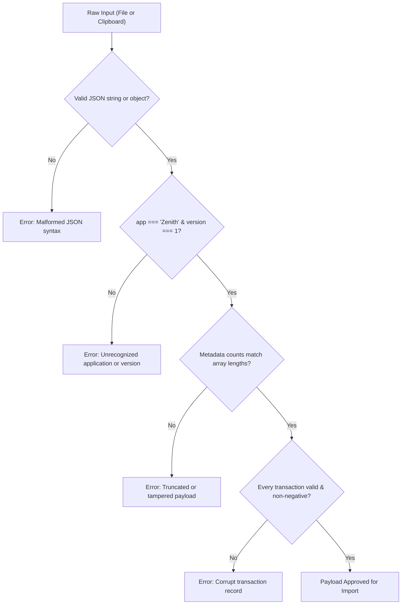
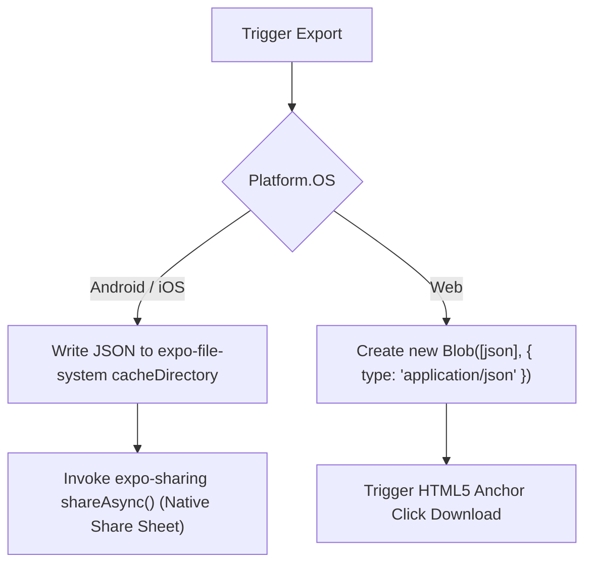

# 05. Data Backup & Disaster Recovery

This module explains Zenith's portable backup protocol, defensive payload validation, cross-platform file export, and dual restoration modes (Merge vs. Overwrite).

---

## 1. The Design Philosophy of Local Backup

Because Zenith has no cloud backend, the user has absolute data ownership. However, device loss or upgrading to a new phone requires a bulletproof backup and restore mechanism.

Zenith uses an open, human-readable **JSON format** rather than proprietary binary SQLite dumps:
- Fully inspectable by the user.
- Immune to SQLite engine version mismatches across iOS and Android.
- Easily transferred via AirDrop, Google Drive, WhatsApp, Email, or Clipboard.

---

## 2. The `ZenithBackupPayload` Specification

Defined in [`src/utils/backup.ts`](file:///c:/Zenith/src/utils/backup.ts#L6-L30), every export adheres to schema version 1:

```json
{
  "version": 1,
  "app": "Zenith",
  "exported_at": "2026-09-12T14:30:00.000Z",
  "metadata": {
    "transaction_count": 142,
    "category_count": 8,
    "recurring_bills_count": 4,
    "currency": "JOD",
    "salary_day": 27
  },
  "data": {
    "transactions": [ ... ],
    "categories": [ ... ],
    "recurring_bills": [ ... ],
    "settings": {
      "currency": "JOD",
      "salary_day": 27,
      "is_balance_hidden": false
    }
  }
}
```

---

## 3. Defensive Schema Validation

Before any payload is allowed to touch SQLite, it must pass strict automated validation in [`validateBackupPayload()`](file:///c:/Zenith/src/utils/backup.ts#L60-L150):



### Critical Validation Checks:
- **Array Integrity**: Metadata count header must match the physical length of the data array. If a user tries to import a file that was truncated mid-download, it is safely rejected before altering the database.
- **Data Invariants**: Transactions must have valid positive amounts, valid ISO-8601 dates, and strictly `'expense'` or `'income'` types.

---

## 4. Restoration Strategies: Merge vs. Overwrite

Located in [`src/db/database.ts`](file:///c:/Zenith/src/db/database.ts#L360-L450), the user is presented with two explicit restore modes:

### Mode 1: Overwrite (Clean Slate)
- Intended for moving to a brand new phone or resetting corrupted data.
- Drops/clears existing `transactions`, `categories`, and `recurring_bills` tables.
- Inserts backup records with their original IDs and restores user preferences.
- Requires explicit user confirmation in the UI.

### Mode 2: Merge (Safe Deduplication)
- Intended for combining data from multiple devices without losing current logs.
- Uses `deduplicateMergeData()` ([`src/utils/backup.ts`](file:///c:/Zenith/src/utils/backup.ts#L170-L245)):
  - **Fingerprinting**: Identifies duplicates by comparing `(date + amount + type + category + merchant)`.
  - If a transaction in the backup already exists on the device, it is skipped.
  - New transactions receive fresh cryptographically random UUIDs to avoid primary key collisions.
  - New custom categories and recurring bills are seamlessly merged.

---

## 5. Cross-Platform File Pipeline

Handling files in a universal React Native / Expo application requires platform-aware branching ([`src/utils/backup.ts`](file:///c:/Zenith/src/utils/backup.ts#L250-L310)):



- **Mobile**: Uses `expo-file-system` and `expo-sharing` to invoke the native iOS Share Sheet / Android Intent Chooser, letting the user save to Google Drive, Files, or send to messaging apps.
- **Web**: Uses browser Blobs and dynamic object URLs to trigger standard browser downloads (`zenith_backup_YYYY-MM-DD.json`).
- **Clipboard Fallback**: Provides a 1-tap `[ Copy JSON ]` and `[ Paste JSON ]` mechanism for instant text-based transfers.
