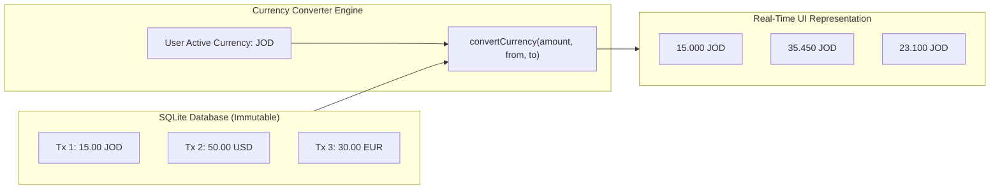

# 06. Currency Engine & Analytics Velocity

This module explores how Zenith handles multi-currency recalculations without mutating historical data, and derives financial velocity metrics like the SVG Category Donut and Savings Rate.

---

## 1. Non-Destructive Multi-Currency Architecture

Most financial applications permanently mutate transaction amounts when converted or restrict users to a single fiat currency.
Zenith uses a **non-destructive on-the-fly conversion pipeline**:



### Why Non-Destructive Storage Matters
- If you travel abroad and spend `50.00 EUR`, Zenith stores `amount: 50.00` and `currency: 'EUR'`.
- If your home currency is `JOD`, the app displays the converted equivalent today.
- If you later switch your display currency to `USD`, Zenith recalculates from the original `50.00 EUR` base, completely avoiding double-conversion rounding errors.

The conversion logic resides in [`src/utils/currencies.ts`](file:///c:/Zenith/src/utils/currencies.ts#L45-L75).

---

## 2. Cash Velocity & Analytics Math

Financial wellness is about velocity: **the rate at which capital leaves your possession relative to the time remaining in your pay cycle**.

Located in [`src/utils/velocity.ts`](file:///c:/Zenith/src/utils/velocity.ts), `calculateMonthAnalytics()` derives real-time metrics:

### 1. Savings Rate
$$\text{Savings Rate} = \begin{cases} \left(\frac{\text{Total Inflow} - \text{Total Outflow}}{\text{Total Inflow}}\right) \times 100\% & \text{if Total Inflow} > 0 \\ 0\% & \text{otherwise} \end{cases}$$
- Positive values render in **Emerald Green** (`#10B981`) indicating capital accumulation.
- Negative values render in **Crimson Red** (`#EF4444`) warning of deficit spending.

### 2. Category Donut Distribution Math
On the Analytics screen ([`src/app/(tabs)/analytics.tsx`](file:///c:/Zenith/src/app/(tabs)/analytics.tsx)), category spending is visualized using an interactive SVG donut chart:
- Each category's percentage $P_i = \frac{\text{Spent}_i}{\text{Total Outflow}}$ maps to an angular sweep:
  $$\Delta \theta_i = P_i \times 360^\circ$$
- SVG arcs are drawn using `react-native-svg` path definitions:
  ```typescript
  // Polar to Cartesian coordinate transformation
  const x = cx + r * Math.cos(angleInRadians);
  const y = cy + r * Math.sin(angleInRadians);
  ```

### 3. Outflow Pace Bar Chart
- Divides the active period into equal weekly intervals.
- Plots the outflow velocity per week, allowing users to immediately spot front-loaded spending early in their salary cycle.

---

## 3. RFC 4180 Statement Exporter

Zenith includes a built-in statement generator in [`src/utils/exportStatement.ts`](file:///c:/Zenith/src/utils/exportStatement.ts):
- Compiles active transactions into an **RFC 4180-compliant CSV** format with escaped string quoting.
- Includes headers: `Date, Type, Category, Merchant, Amount, Currency, Payment Method, Note`.
- Delivers the exported spreadsheet directly to the user via `expo-sharing` (native share sheet) or clipboard summary copying.
