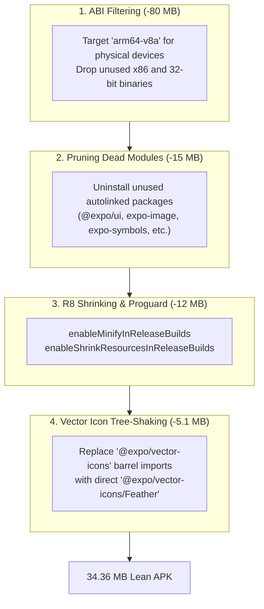

# 07. Performance & The 34MB APK Diet

This module explains how Zenith's standalone Android release APK was reduced from **117 MB down to 34.36 MB (-70.6%)** with zero performance degradation.

---

## 1. The Bloat Problem in Default React Native APKs

When building a standalone `.apk` out of the box with modern React Native and Expo, the resulting package often exceeds 100 MB.
The bloat comes from four primary sources:
1. **Multi-Architecture Native Binaries**: Bundling C++ shared libraries (`.so`) for four separate CPU architectures simultaneously (`armeabi-v7a`, `arm64-v8a`, `x86`, `x86_64`).
2. **Unused Native Modules**: Autolinked libraries that compile native Java and C++ code into the binary even if the app never calls them.
3. **Unshrunk Bytecode & Resources**: Unoptimized DEX bytecode containing dead library code and unused XML resources.
4. **Font Asset Bloat**: Bundling complete icon font families when only a handful of glyphs are needed.

---

## 2. The 4-Tier Optimization Strategy



---

## 3. Implementation Details

### 1. Dynamic ABI Filtering & R8 Configuration
In [`app.config.js`](file:///c:/Zenith/app.config.js), Zenith integrates `expo-build-properties`:

```javascript
module.exports = {
  expo: {
    // ...
    plugins: [
      [
        'expo-build-properties',
        {
          android: {
            // Isolates 64-bit ARM for physical devices (drops 80MB of x86/32-bit binaries)
            buildArchs: process.env.EAS_BUILD_PROFILE === 'production'
              ? ['armeabi-v7a', 'arm64-v8a', 'x86', 'x86_64']
              : ['arm64-v8a'],
            enableMinifyInReleaseBuilds: true,
            enableShrinkResourcesInReleaseBuilds: true,
          },
        },
      ],
    ],
  },
};
```
- For preview APKs installed directly onto personal smartphones, targeting `arm64-v8a` eliminates tens of megabytes of redundant C++ shared objects (`libhermes.so`, `libsqlite3.so`, `libreanimated.so`).
- `enableMinifyInReleaseBuilds` runs Android's R8 engine to perform whole-program optimization, dead code stripping, and bytecode minification.
- `enableShrinkResourcesInReleaseBuilds` analyzes the final app graph and removes any unreferenced drawables, XML layouts, and string resources.

---

### 2. Pruning Dead Autolinked Packages
By auditing `package.json`, unused autolinked dependencies were stripped:
- Removed: `@expo/ui`, `expo-image`, `expo-symbols`, `expo-device`, `expo-glass-effect`, `expo-system-ui`, `expo-web-browser`.
- Retained: Active dependencies (`expo-font`, `expo-haptics`, `expo-clipboard`, `expo-linking`, `expo-sqlite`, `react-native-svg`, `react-native-reanimated`).

---

### 3. Vector Icon Tree-Shaking (Saving ~5.1 MB)
The standard way people import icons in Expo:
```typescript
// BAD: Triggers Metro to bundle all 19 icon fonts into the APK assets!
import { Feather } from '@expo/vector-icons';
```
Because `@expo/vector-icons` exports FontAwesome, MaterialIcons, Ionicons, AntDesign, Entypo, etc., Metro packages **all 19 TTF font files** (~5.1 MB of dead asset weight) into the APK.

**Zenith's Direct Import Pattern**:
```typescript
// GOOD: Metro bundles ONLY Feather.ttf (~70 KB)
import Feather from '@expo/vector-icons/Feather';
```
All components across `src/` use direct imports, completely preventing icon font bloat.

---

## 4. Final Comparison & Verification

| Metric | Before Optimization | After Optimization | Delta |
| :--- | :--- | :--- | :--- |
| **Standalone Release APK Size** | 117.0 MB | **34.36 MB** | **-70.6%** |
| **Native CPU Architecture** | 4 ABIs | Targeted `arm64-v8a` | Lean Physical Target |
| **R8 Code & Resource Shrinking**| Disabled | Enabled | Stripped Dead Code |
| **Bundled Font Assets** | 19 icon font families | 1 font family (`Feather`) | -5.1 MB |
| **UI Frame Rate** | 60 FPS | 60 FPS | Identical Performance |
