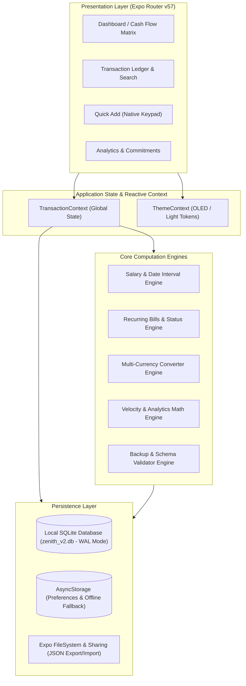

# Zenith Architecture & Engineering Guide

Welcome to the Zenith engineering and architecture documentation. This directory provides an in-depth, first-principles exploration of how Zenith is built, why key technical decisions were made, and how each subsystem operates.

---

## The Zenith Philosophy

Zenith is not a typical personal finance application. It rejects the conventional model of bank scraping, complex double-entry accounting, advertising telemetry, and cloud storage in favor of four bedrock tenets:

1. **100% Local-First & Zero Telemetry**: Your financial data belongs exclusively on your physical device. There are no tracking SDKs, no external analytics pings, and no mandatory cloud accounts.
2. **Binary Cash Velocity**: Personal cash flow boils down to two atomic forces: **Outflow** (Expenses) and **Inflow** (Income). We eliminate split bills, transfers, credit line adjustments, and merchant bureaucracy in favor of high-contrast red/green financial physics.
3. **Payday Alignment Over Calendar Months**: Real people live paycheck to paycheck or salary cycle to salary cycle. A monthly budget that runs from the 1st to the 31st arbitrarily splits a 27th-to-26th salary in half. Zenith treats salary cycles as first-class citizens.
4. **Lightweight & High Performance**: Clean native execution on React Native 0.86, React 19, Expo SDK 57, and Reanimated 4.5, packaged into a tight **34.36 MB** native binary.

---

## High-Level System Architecture

---

## Curriculum Roadmap

| Module | Topic | Core Source Files |
| :--- | :--- | :--- |
| **[01. App Architecture & State Flow](./01-app-architecture.md)** | Bootstrap lifecycle, provider hierarchy, Expo Router layout, and reactive context | [`src/app/_layout.tsx`](file:///c:/Zenith/src/app/_layout.tsx), [`src/context/TransactionContext.tsx`](file:///c:/Zenith/src/context/TransactionContext.tsx) |
| **[02. Database & Offline Storage](./02-database-and-offline-storage.md)** | SQLite schema, WAL mode, indexing, migrations, and the dual-storage resilience model | [`src/db/schema.ts`](file:///c:/Zenith/src/db/schema.ts), [`src/db/database.ts`](file:///c:/Zenith/src/db/database.ts) |
| **[03. Salary Cycle Engine](./03-salary-cycle-engine.md)** | Payday math, month length variations, period stepping algorithm, and boundary checks | [`src/utils/dateInterval.ts`](file:///c:/Zenith/src/utils/dateInterval.ts), [`src/utils/salary.ts`](file:///c:/Zenith/src/utils/salary.ts) |
| **[04. Recurring Bills System](./04-recurring-bills-system.md)** | Subscription due date projection, 4-state lifecycle, and 1-tap logging with duplicate prevention | [`src/utils/recurring.ts`](file:///c:/Zenith/src/utils/recurring.ts), [`src/components/UpcomingBillsWidget.tsx`](file:///c:/Zenith/src/components/UpcomingBillsWidget.tsx) |
| **[05. Backup & Disaster Recovery](./05-backup-and-disaster-recovery.md)** | JSON schema validation, checksum verification, Merge vs Overwrite restoration strategies | [`src/utils/backup.ts`](file:///c:/Zenith/src/utils/backup.ts), [`src/components/BackupRestoreModal.tsx`](file:///c:/Zenith/src/components/BackupRestoreModal.tsx) |
| **[06. Currency & Analytics Velocity](./06-currency-and-analytics.md)** | Non-destructive multi-currency recalculation, SVG donut chart math, and outflow pace velocity | [`src/utils/currencies.ts`](file:///c:/Zenith/src/utils/currencies.ts), [`src/utils/velocity.ts`](file:///c:/Zenith/src/utils/velocity.ts) |
| **[07. Performance & 34MB APK Diet](./07-performance-and-apk-diet.md)** | ABI targeting (`arm64-v8a`), R8 DEX optimization, resource shrinking, and icon font tree-shaking | [`app.config.js`](file:///c:/Zenith/app.config.js), [`eas.json`](file:///c:/Zenith/eas.json) |

---

## How to Navigate This Codebase

When inspecting or extending Zenith, follow this standard pattern:
1. **Types First**: Check [`src/db/schema.ts`](file:///c:/Zenith/src/db/schema.ts) to see the data contract.
2. **Database Operations**: Check [`src/db/database.ts`](file:///c:/Zenith/src/db/database.ts) to see SQL table definitions and queries.
3. **Pure Logic & Calculations**: Check pure helper functions under [`src/utils/`](file:///c:/Zenith/src/utils/) (these have dedicated unit tests under [`tests/`](file:///c:/Zenith/tests/)).
4. **State Exposure**: Check [`src/context/TransactionContext.tsx`](file:///c:/Zenith/src/context/TransactionContext.tsx) to see how components consume the data.
5. **Presentation**: Check [`src/app/(tabs)/`](file:///c:/Zenith/src/app/(tabs)/) for screens and [`src/components/`](file:///c:/Zenith/src/components/) for reusable UI widgets.
