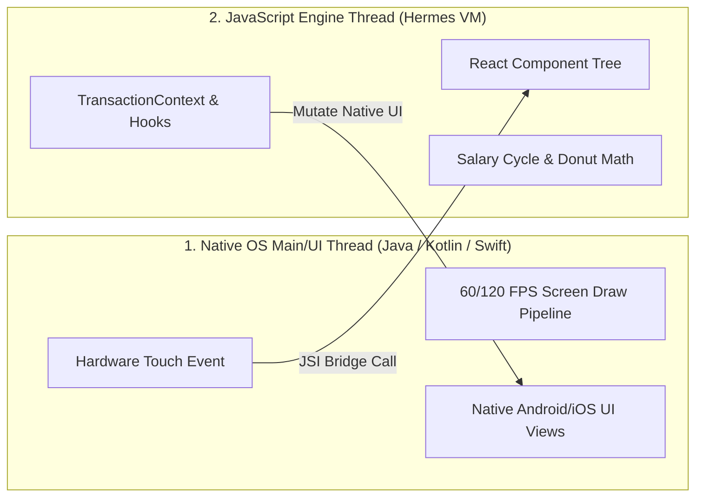
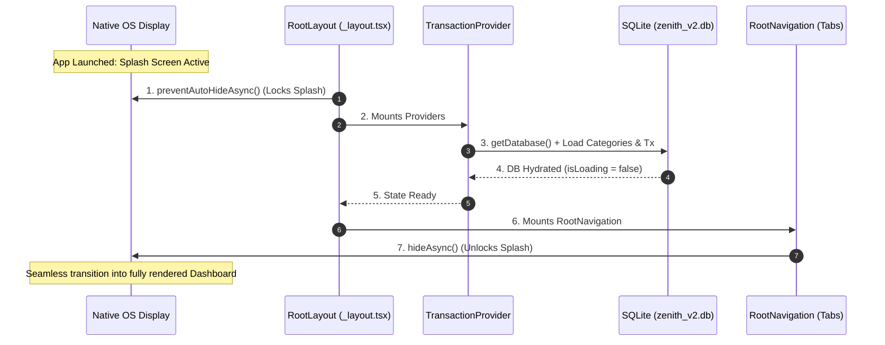
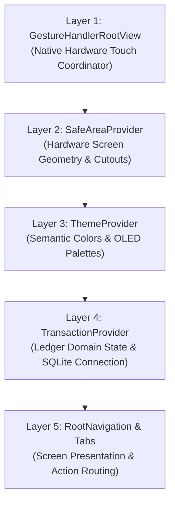
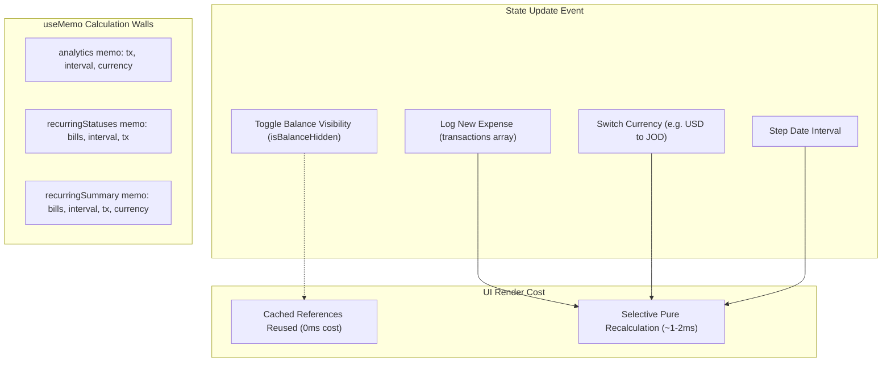
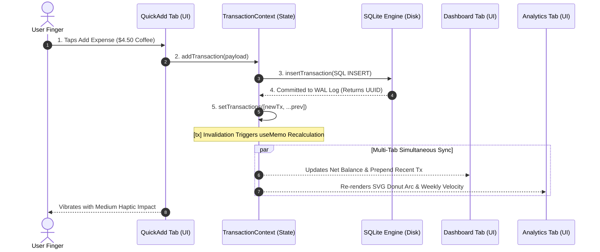

---
aliases:
  - 01. App Architecture & State Flow
tags:
  - zenith
  - architecture
  - react-native
  - expo
---

# 01. App Architecture & State Flow

Zenith is engineered as an offline-first, local ledger. This reference document details the complete runtime lifecycle: how Expo Router v57 boots the application, coordinates native splash screen presentation with asynchronous SQLite initialization, organizes the hierarchical provider stack, and maintains high-performance reactive state propagation across all tabs without unnecessary re-renders.

---

## 1. The Dual-Thread Execution Model

React Native executes application logic across two independent threads: the **Native Main/UI Thread** and the **Hermes JavaScript Engine Thread**.



### The 16.6ms Frame Budget
- For smooth 60 FPS animations, the Native Main Thread must paint a new frame every **16.6 milliseconds** (or 8.3ms on 120Hz displays).
- If the JavaScript thread performs heavy synchronous blocking work, or if the Native Main Thread waits on flash storage I/O, the UI thread misses its frame deadline.
- The user perceives this as dropped frames ("jank"), stuttering scrolls, and sluggish touch input.

### Asynchronous I/O Rule
Because of this hard timing budget, all storage and device hardware interactions in Zenith (`expo-sqlite`, `AsyncStorage`, `expo-file-system`) are strictly non-blocking and asynchronous:

```typescript
// Asynchronous: The JavaScript thread delegates reading to background native workers,
// yielding execution immediately so animations and gestures stay pinned at 60 FPS.
const db = await SQLite.openDatabaseAsync('zenith_v2.db');
```

---

## 2. Splash Screen Coordination & Lifecycle Gate

Because storage reads are asynchronous, an app startup race condition naturally exists:
1. The phone's native window manager displays the splash screen while loading the JavaScript bundle into memory.
2. By default, the operating system dismisses the splash screen the instant the JavaScript bundle starts executing.
3. However, establishing the SQLite database connection (`openDatabaseAsync`) and reading user preferences from disk takes between **20ms to 200ms**.

If the splash screen were to dismiss immediately, the user would see a momentary white flash, un-themed surfaces, or zeroed numbers (`$0.00`) before data loaded.

### The Splash Screen Freeze Gate
To eliminate this visual flicker, Zenith freezes the splash screen at the top of [`src/app/_layout.tsx`](file:///c:/Zenith/src/app/_layout.tsx#L10):

```typescript
import * as SplashScreen from 'expo-splash-screen';

// 1. FREEZE: Tell the native OS NOT to hide the splash screen automatically
SplashScreen.preventAutoHideAsync().catch(() => {});
```

### The Unfreeze Sequence
The splash screen is held frozen until all providers have initialized and [`RootNavigation`](file:///c:/Zenith/src/app/_layout.tsx#L12-L27) mounts:



```typescript
function RootNavigation() {
  const { isDark } = useTheme();

  useEffect(() => {
    // 2. UNFREEZE: Dismiss splash screen ONLY when theme & layout are mounted
    SplashScreen.hideAsync().catch(() => {});
  }, []);

  return (
    <>
      <StatusBar style={isDark ? 'light' : 'dark'} />
      <Stack screenOptions={{ headerShown: false }}>
        <Stack.Screen name="(tabs)" />
      </Stack>
    </>
  );
}
```

---

## 3. Strict Provider Topology

Zenith organizes its root component wrapper in [`src/app/_layout.tsx`](file:///c:/Zenith/src/app/_layout.tsx#L29-L41) into a strictly ordered hierarchy based on platform and domain dependencies:

```tsx
export default function RootLayout() {
  return (
    <GestureHandlerRootView style={{ flex: 1 }}>
      <SafeAreaProvider>
        <ThemeProvider>
          <TransactionProvider>
            <RootNavigation />
          </TransactionProvider>
        </ThemeProvider>
      </SafeAreaProvider>
    </GestureHandlerRootView>
  );
}
```



### Why Order Matters
- **Layer 1 (`GestureHandlerRootView`)**: Intercepts raw OS touch events before they reach React. Must wrap the absolute native root window; otherwise, bottom-sheet drags, panning modals, and swipe-to-delete interactions fail to receive native gestures.
- **Layer 2 (`SafeAreaProvider`)**: Calculates hardware cutouts (camera notches, dynamic islands, home bars) and provides `useSafeAreaInsets()`. All UI components beneath it depend on these values for layout padding.
- **Layer 3 (`ThemeProvider`)**: Injects semantic color tokens (`colors.background`, `colors.danger`, `colors.success`). It must wrap `TransactionProvider` so that transaction context modals, toast notifications, and loading spinners have access to the active theme palette.
- **Layer 4 (`TransactionProvider`)**: Holds the primary financial ledger state, SQLite database handlers, and calculation pipelines for all screen routes.

---

## 4. State Reactivity & Memoization Walls

In React, whenever a top-level Context Provider updates its state, all child components subscribed to that context re-render.

In an active personal finance app:
- A user may have accumulated thousands of transactions.
- The **Analytics** screen performs expensive mathematical calculations (SVG Donut arc geometries, weekly outflow pace, and savings rate percentages).
- The **Dashboard** calculates the net balance, remaining salary days, and recurring liabilities.

If every state change triggered full recalculations of all financial metrics, routine interactions—such as toggling balance privacy (`isBalanceHidden`)—would introduce noticeable UI frame drops.

### The 5 `useMemo` Calculation Walls
In [`src/context/TransactionContext.tsx`](file:///c:/Zenith/src/context/TransactionContext.tsx#L125-L165), Zenith insulates heavy mathematical operations behind explicit dependency arrays:

```typescript
// 1. Heavy SVG Donut & Weekly Velocity Calculation
const analytics = useMemo(() => {
  return calculateMonthAnalytics(transactions, dateInterval, currency);
}, [transactions, dateInterval, currency]);

// 2. Recurring Bills Due Date & Overdue Projection
const recurringStatuses = useMemo(() => {
  return recurringBills.map(bill =>
    evaluateBillStatusInInterval(bill, dateInterval, transactions)
  );
}, [recurringBills, dateInterval, transactions]);

// 3. Fixed Liabilities Cycle Summary
const recurringSummary = useMemo(() => {
  return calculateRecurringSummaries(recurringBills, dateInterval, transactions, currency);
}, [recurringBills, dateInterval, transactions, currency]);

// 4. Period Boundary Constraints
const isCurrentInterval = useMemo(() => {
  return isCurrentPeriodUtil(dateInterval, salaryDay);
}, [dateInterval, salaryDay]);

const canGoNext = useMemo(() => {
  return canStepNextUtil(dateInterval, salaryDay);
}, [dateInterval, salaryDay]);
```

### The Invalidation Matrix



- When `isBalanceHidden` changes, only the specific card displaying the balance re-renders. The `analytics`, `recurringStatuses`, and `recurringSummary` memos detect zero dependency changes and return their cached references in **0 milliseconds**.
- When a new transaction is logged, only memos depending on `transactions` invalidate and recalculate.

---

## 5. End-to-End Execution Trace

To observe how all architectural layers collaborate, trace what occurs when a user enters `$4.50` on the Quick Add numpad and taps **`[ Add Expense ]`**:



### Execution Steps
1. **User Interaction & Validation** ([`src/app/(tabs)/quick-add.tsx`](file:///c:/Zenith/src/app/(tabs)/quick-add.tsx#L110-L135)):
   The native UI thread handles the button tap and dispatches the event to the Hermes JS thread. Input numbers are validated, and haptic feedback triggers via `Haptics.impactAsync`.
2. **Database Mutation** ([`src/db/database.ts`](file:///c:/Zenith/src/db/database.ts#L130-L165)):
   `addTransaction` calls `db.insertTransaction()`. An atomic SQL `INSERT` statement is written to SQLite's Write-Ahead Log:
   ```sql
   INSERT INTO transactions (id, amount, type, category, merchant, note, date, payment_method, currency, created_at)
   VALUES (?, ?, ?, ?, ?, ?, ?, ?, ?, ?);
   ```
3. **State Dispatch** ([`src/context/TransactionContext.tsx`](file:///c:/Zenith/src/context/TransactionContext.tsx#L250-L265)):
   Once SQLite returns the newly created transaction record, `setTransactions(prev => [created, ...prev])` updates the reactive state array. A shadow backup is asynchronously scheduled to `AsyncStorage`.
4. **Targeted Memo Invalidation**:
   Because the `transactions` array reference updated:
   - `analytics` recomputes the new total spend and updates SVG slice angles.
   - `recurringStatuses` checks if this expense matches an active recurring bill.
5. **Synchronized Multi-Tab Projection**:
   Because `TransactionProvider` wraps the entire tab hierarchy, the Dashboard, Ledger, and Analytics screens receive the updated state simultaneously. When the user switches tabs, the updated data is already rendered with zero network latency, zero polling intervals, and zero stale UI.

---

## 6. Architecture Invariants Reference

| Principle | Technical Reality | Implementation in Zenith |
| :--- | :--- | :--- |
| **Dual-Thread Execution** | Disk I/O blocks the UI thread if not offloaded. | All SQLite queries and file operations run asynchronously via promises. |
| **Startup Coordination** | Asynchronous disk access creates a startup pop. | `SplashScreen.preventAutoHideAsync()` holds display until `RootNavigation` mounts. |
| **Provider Hierarchy** | Platform touch and geometry wrappers must enclose business logic. | `GestureHandlerRootView` $\to$ `SafeAreaProvider` $\to$ `ThemeProvider` $\to$ `TransactionProvider`. |
| **Memoization Walls** | Context state dispatches re-render all subscribers. | `useMemo` dependency arrays isolate heavy SVG math, bills, and cycle metrics. |
| **Unidirectional Flow** | State mutations must flow from a single source of truth. | UI Action $\to$ SQLite WAL Commit $\to$ Context Dispatch $\to$ Multi-Tab Sync. |
