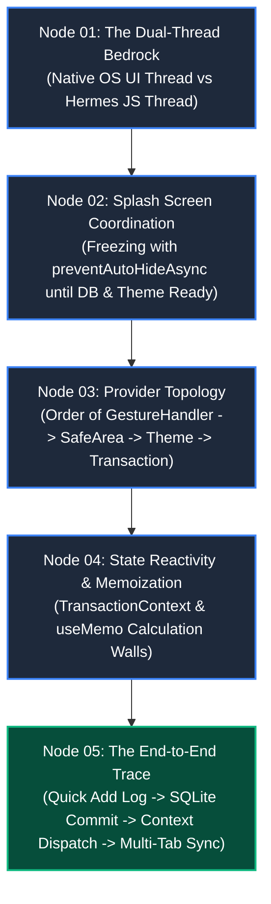
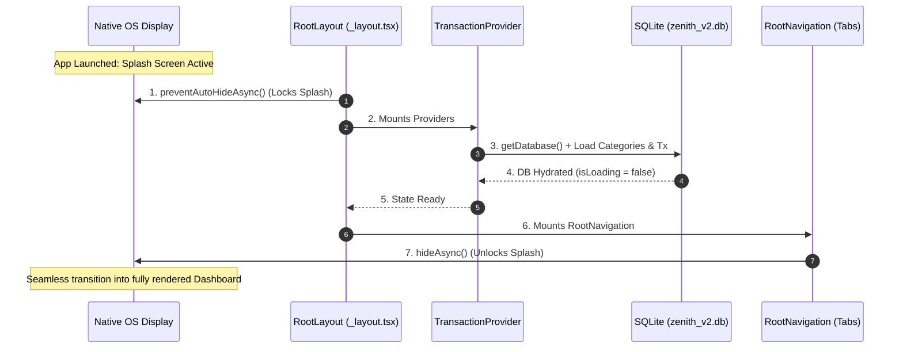
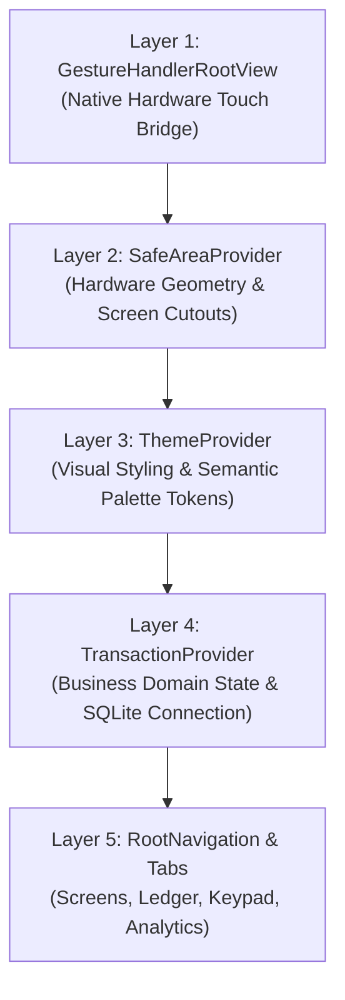
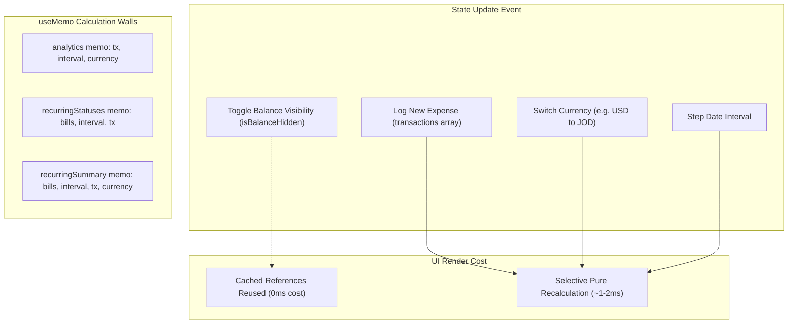
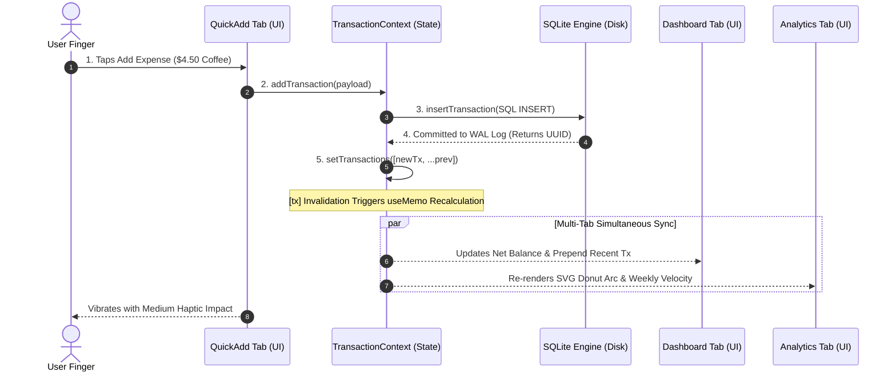

---
aliases:
  - 01. App Architecture & State Flow
tags:
  - zenith
  - architecture
  - react-native
  - expo
---

# 01. App Architecture & State Flow

> [!abstract] Topic Overview
> An in-depth masterclass on Zenith's runtime architecture: how Expo Router v57 boots the app, coordinates the splash screen with asynchronous SQLite initialization, organizes the provider hierarchy, and guarantees responsive, unidirectional state propagation across all tabs.

---

> [!quote] USER
> /learn 
> md log 
> 01. App Architecture & State Flow
> C:\Users\khoja\OneDrive - University Of Jordan\Documents\obs\Learning\Zenith\01. App Architecture & State Flow.md

> [!abstract] ASSISTANT
> Linked Obsidian session logger to `01. App Architecture & State Flow.md`.
> 
> Beginning **Phase 1 (Probe)** of the teaching loop. Before mapping the dependency graph, we will run a rapid diagnostic quiz to bracket your knowledge frontier (floor & ceiling) regarding React Native execution, provider tree topologies, and Expo Router navigation lifecycles.

---

### Diagnostic Probe 1: App Bootstrapping & Asynchronous State

> [!question] Diagnostic Question 1
> In an offline-first Expo application like Zenith, what happens if the splash screen auto-hides before the local SQLite database and theme state have finished loading?
> - (A) The user observes a brief blank or un-themed flash of uninitialized UI.
> - (B) The native Android/iOS runtime throws an immediate SIGSEGV process termination.
> - (C) The JavaScript Hermes thread permanently freezes waiting for background native I/O.
> - (D) The Expo Router navigation stack resets back to the root index redirect.
> - (E) I don't know / Not sure yet.

> [!quote] USER
> A1: I don't know / Not sure yet.

> [!abstract] Diagnosis & Bedrock Fact
> **Frontier Located**: We found the ceiling for native splash orchestration.
> 
> **The Bedrock Principle**:
> In React Native, the **Native OS Thread** (rendering Android Views / iOS UIViews) and the **JavaScript Thread** (Hermes executing your TypeScript code) run concurrently.
> 
> When an app opens:
> 1. The native OS displays the splash screen while loading the JavaScript bundle.
> 2. By default, the OS dismisses the splash screen the instant the JS bundle starts executing.
> 3. BUT connecting to SQLite (`openDatabaseAsync`) and loading user theme preferences are **asynchronous** operations that take 20ms to 200ms.
> 
> If the splash screen dismisses immediately, the user sees an un-themed white canvas or empty zeroed numbers. In Zenith, we hold the splash screen frozen with `SplashScreen.preventAutoHideAsync()` until every provider is hydrated.

---

### Diagnostic Probe 2: React Context & State Invalidation

> [!question] Diagnostic Question 2
> In React and React Native, what happens when a top-level Context Provider (like a Theme or Transaction store) updates its state value?
> - (A) All child components consuming that context re-render with the new state.
> - (B) All sibling component subtrees unmount and recreate their internal states.
> - (C) Only the root layout component re-renders while children retain cached nodes.
> - (D) The native device OS suspends background execution until the next UI frame.
> - (E) I don't know / Not sure yet.

> [!quote] USER
> A1: All child components consuming that context re-render with the new state.

> [!success] Correct!
> **Floor Established**: You have a rock-solid understanding of React's Context API and subscription model. When state updates inside `TransactionProvider`, every mounted subscriber (e.g. Dashboard cards, ledger rows, analytics charts) re-evaluates its render tree.
> 
> With your **floor** (React Context & re-rendering) and **ceiling** (native splash orchestration & async thread coordination) firmly bracketed, we can now construct the motivated dependency path.

---

## Phase 2: The Learning Dependency Graph (DAG)

To understand how Zenith operates without magic, we will build from the bedrock dual-thread foundation up to an end-to-end trace of a user transaction:



### Learning Plan
1. **Node 01**: Why React Native requires two threads and how asynchronous communication works across the bridge/JSI.
2. **Node 02**: How `SplashScreen.preventAutoHideAsync()` in [`src/app/_layout.tsx`](file:///c:/Zenith/src/app/_layout.tsx) prevents layout flickers while SQLite opens in the background.
3. **Node 03**: Why the provider tree must be nested in exact sequence, and what breaks if you invert them.
4. **Node 04**: How `TransactionContext` prevents re-render storms across tabs by caching derived math with `useMemo`.
5. **Node 05**: Walking step-by-step through a real transaction being logged, from thumb tap to database file commit and chart redraw.

---

## Phase 3: The Node Loop

### Node 01: The Dual-Thread Bedrock

> [!abstract] Motivating Principle
> Why does a React Native application feel like native software, even though your application logic is authored in TypeScript?

#### 1. The Two Worlds Inside Your Phone
When an Android or iOS device runs Zenith, it executes across **two independent threads**:


#### 2. The 16.6ms Frame Budget
- To render smooth animations at 60 frames per second, the Native UI thread must paint a new frame every **16.6 milliseconds** (or 8.3ms at 120Hz).
- If the JavaScript thread performs heavy synchronous work, or if the Native Main Thread is blocked waiting for flash storage I/O, the UI thread **misses the frame deadline**.
- The result on screen is dropped frames ("jank"), stuttering scrolls, and unresponsive buttons.

#### 3. Why Asynchronous I/O is Non-Negotiable
Because of this 16ms rule, every hardware and storage interaction in Zenith (`expo-sqlite`, `AsyncStorage`, `expo-file-system`) is strictly **asynchronous**:
```typescript
// Asynchronous: The JavaScript thread asks the native SQLite worker to read,
// and yields execution immediately so animations remain 60fps.
const db = await SQLite.openDatabaseAsync('zenith_v2.db');
```
This asynchronous separation keeps the UI silky smooth, but introduces our next challenge: **startup race conditions**.

> [!question] Node 01 Checkpoint
> Why does React Native offload file I/O and SQLite queries to background worker threads instead of running them synchronously on the Native Main/UI thread?
> - (A) Running disk I/O on the main thread drops frames and freezes UI touch gestures.
> - (B) Running disk I/O on the main thread forces the operating system kernel to terminate the process.
> - (C) Running disk I/O on the main thread corrupts the active JavaScript heap memory addresses.
> - (D) Running disk I/O on the main thread triggers an immediate recompilation of the Hermes bytecode bundle.
> - (E) I don't know / Not sure yet.

> [!quote] USER
> A1: Running disk I/O on the main thread drops frames and freezes UI touch gestures.

> [!success] Correct!
> **Node 01 Locked In**: Exactly. The Native UI thread has a strict 16.6ms budget. Any synchronous storage access on that thread directly stalls frame painting and touch event dispatch.

---

### Node 02: Splash Screen Coordination & Lifecycle Gate

> [!abstract] Motivating Principle
> In Node 01, we discovered that reading SQLite and storage from disk is strictly asynchronous.
> When the user taps the app icon, the phone's native window manager displays the native Splash Screen immediately.
> 
> If we let the native OS hide the splash screen as soon as the JS bundle loads, what does the user see?
> They see a blank white screen, zeroed metrics (`$0.00`), and missing categories while SQLite is still opening in the background.

#### 1. The Splash Screen Freeze Gate
To eliminate this "startup pop", Zenith installs a deliberate gate at the top of [`src/app/_layout.tsx`](file:///c:/Zenith/src/app/_layout.tsx#L10):

```typescript
import * as SplashScreen from 'expo-splash-screen';

// 1. FREEZE: Tell the native OS NOT to hide the splash screen automatically
SplashScreen.preventAutoHideAsync().catch(() => {});
```

This simple call freezes the native splash screen in place over the device display.

#### 2. The Coordination Flow



#### 3. Unfreezing at the Root
Inside [`src/app/_layout.tsx`](file:///c:/Zenith/src/app/_layout.tsx#L12-L27), the `RootNavigation` component waits until the context and theme tree are active before dismissing the splash screen:

```typescript
function RootNavigation() {
  const { isDark } = useTheme();

  useEffect(() => {
    // 2. UNFREEZE: Dismiss splash screen ONLY when theme & layout are mounted
    SplashScreen.hideAsync().catch(() => {});
  }, []);

  return (
    <>
      <StatusBar style={isDark ? 'light' : 'dark'} />
      <Stack screenOptions={{ headerShown: false }}>
        <Stack.Screen name="(tabs)" />
      </Stack>
    </>
  );
}
```

Because `preventAutoHideAsync()` held the frame, the user experiences zero white flashes, zero content snapping, and 100% theme consistency on launch.

> [!question] Node 02 Checkpoint
> In Zenith's root layout, where is SplashScreen.hideAsync() invoked to guarantee that the user never sees an un-themed or empty screen?
> - (A) Inside the root navigation component after the theme and provider hierarchy mount.
> - (B) Inside the native SQLite database initialization promise callback before React boots.
> - (C) Inside the tab bar component once the user completes their first navigation tap.
> - (D) Inside the Android manifest configuration file before the Hermes engine initializes.
> - (E) I don't know / Not sure yet.

> [!quote] USER
> A1: Inside the root navigation component after the theme and provider hierarchy mount.

> [!success] Correct!
> **Node 02 Locked In**: Spot on. It unfreezes only inside `RootNavigation`'s `useEffect`, ensuring all providers, theme tokens, and the initial navigation container are fully mounted in memory before exposing the UI to the user.

---

### Node 03: Provider Topology & The Nesting Rule

> [!abstract] Motivating Principle
> Look at the root wrapper in [`src/app/_layout.tsx`](file:///c:/Zenith/src/app/_layout.tsx#L29-L41):
> 
> ```tsx
> export default function RootLayout() {
>   return (
>     <GestureHandlerRootView style={{ flex: 1 }}>
>       <SafeAreaProvider>
>         <ThemeProvider>
>           <TransactionProvider>
>             <RootNavigation />
>           </TransactionProvider>
>         </ThemeProvider>
>       </SafeAreaProvider>
>     </GestureHandlerRootView>
>   );
> }
> ```
> 
> Why can't we arrange these in an arbitrary order? Why does `GestureHandlerRootView` have to be at the very top, and why must `ThemeProvider` wrap `TransactionProvider`?

#### 1. The 4 Structural Layers



#### 2. The Failure Modes of Incorrect Ordering
- **If `GestureHandlerRootView` is not the root**:
  `react-native-gesture-handler` intercepts raw OS touch events before they reach React. If it is placed inside child components or screens, native swipe gestures (like panning modals, swipe-to-delete on transactions, and bottom sheet drags) fail to receive native motion events or cause fatal runtime crashes.
- **If `SafeAreaProvider` is placed below UI providers**:
  Hardware insets (notch depth, dynamic island heights, Android navigation bars) cannot be calculated for any components wrapped above it.
- **If `ThemeProvider` is placed inside `TransactionProvider`**:
  `TransactionContext` components, custom modal alerts, and loading spinners would be unable to consume `useTheme()` tokens (`colors.background`, `colors.danger`, `colors.success`).

Each layer strictly provides the context required by the layers beneath it.

> [!question] Node 03 Checkpoint
> What is the primary technical failure that occurs if GestureHandlerRootView is omitted from the root of the React Native component hierarchy?
> - (A) Native gesture handlers fail to receive touch events and throw runtime errors.
> - (B) The SQLite database connection terminates due to an unhandled bridge exception.
> - (C) The device hardware screen orientation permanently locks to landscape orientation.
> - (D) The TypeScript compiler fails to resolve JSX component element definitions.
> - (E) I don't know / Not sure yet.

> [!quote] USER
> A1: Native gesture handlers fail to receive touch events and throw runtime errors.

> [!success] Correct!
> **Node 03 Locked In**: Exactly. Gesture handler must wrap the absolute root so its native gesture coordinator can attach to the root Android DecorView or iOS UIWindow.

---

### Node 04: State Reactivity & Memoization Walls

> [!abstract] Motivating Principle
> In Phase 1 Diagnostic Probe 2, you proved that when a top-level React Context updates its state, **all consuming child components re-render**.
> 
> In Zenith:
> - A user might have logged **2,000 transactions** across a year.
> - The **Analytics tab** computes an SVG Donut chart, Weekly Velocity bars, and Savings Rate.
> - The **Dashboard** computes Net Cash Flow, Salary Countdown, and Recurring Commitments.
> 
> What happens if the user simply taps the "Eye" icon to hide/show their balance (`isBalanceHidden`)?
> Does the app re-sort, re-filter, and re-draw all 2,000 transactions and recalculate all SVG angles?
> If it did, your phone would freeze for 50ms on every tap.

#### 1. The `useMemo` Calculation Wall
To prevent calculation thrashing, [`TransactionContext.tsx`](file:///c:/Zenith/src/context/TransactionContext.tsx#L125-L165) constructs **memoization walls**:

```typescript
// 1. Heavy SVG Donut & Weekly Velocity Calculation
const analytics = useMemo(() => {
  return calculateMonthAnalytics(transactions, dateInterval, currency);
}, [transactions, dateInterval, currency]);

// 2. Heavy Recurring Bills Due-Date & Overdue Projection
const recurringStatuses = useMemo(() => {
  return recurringBills.map(bill =>
    evaluateBillStatusInInterval(bill, dateInterval, transactions)
  );
}, [recurringBills, dateInterval, transactions]);

// 3. Fixed Liabilities Cycle Summary
const recurringSummary = useMemo(() => {
  return calculateRecurringSummaries(recurringBills, dateInterval, transactions, currency);
}, [recurringBills, dateInterval, transactions, currency]);
```

#### 2. The Invalidation Matrix



When `isBalanceHidden` changes, React re-renders the subscribed card, but **`analytics`, `recurringStatuses`, and `recurringSummary` skip re-execution completely**, returning their cached object pointers in 0 milliseconds.

> [!question] Node 04 Checkpoint
> In TransactionContext, what happens to the heavy SVG Donut chart calculation when a user toggles isBalanceHidden?
> - (A) The calculation is skipped entirely because its dependency array did not change.
> - (B) The calculation re-runs immediately because any context state update forces all memo hooks to recompute.
> - (C) The calculation dispatches a background query to SQLite to verify the transaction count.
> - (D) The calculation purges the cached SVG path strings and unmounts the analytics tab.
> - (E) I don't know / Not sure yet.

> [!quote] USER
> A1: The calculation is skipped entirely because its dependency array did not change.

> [!success] Correct!
> **Node 04 Locked In**: Exactly. Because `isBalanceHidden` is not included in the `analytics` dependency array `[transactions, dateInterval, currency]`, `useMemo` instantly returns the existing memoized object reference without executing a single line of calculation.

---

### Node 05: The End-to-End Execution Trace

> [!abstract] Motivating Principle
> We have mastered every constituent part: the dual-thread runtime, splash synchronization, provider nesting, and memoization walls.
> Now, we will connect all four nodes to trace a real-world user action from start to finish.
> 
> **Scenario**: The user is on the Quick-Add tab ([`src/app/(tabs)/quick-add.tsx`](file:///c:/Zenith/src/app/(tabs)/quick-add.tsx)). They type `$4.50`, select `Food & Dining`, and tap **`[ Add Expense ]`**.
> What happens across the entire system?

#### 1. The 5-Step Execution Pipeline



#### 2. Code Execution Breakdown

1. **Native Touch & Validation** ([`src/app/(tabs)/quick-add.tsx`](file:///c:/Zenith/src/app/(tabs)/quick-add.tsx#L110-L135)):
   The native UI thread detects the button press and dispatches the event to the Hermes JS thread. The input amount (`4.50`) is validated to ensure it is positive.
2. **Database Mutation** ([`src/db/database.ts`](file:///c:/Zenith/src/db/database.ts#L130-L165)):
   `addTransaction` calls `db.insertTransaction()`. An atomic SQL `INSERT` executes against SQLite's Write-Ahead Log:
   ```sql
   INSERT INTO transactions (id, amount, type, category, merchant, note, date, payment_method, currency, created_at)
   VALUES (?, ?, ?, ?, ?, ?, ?, ?, ?, ?);
   ```
3. **State Dispatch** ([`src/context/TransactionContext.tsx`](file:///c:/Zenith/src/context/TransactionContext.tsx#L250-L265)):
   Once SQLite confirms the write, `setTransactions(prev => [created, ...prev])` dispatches the new immutable array into React state.
4. **Targeted Memo Invalidation**:
   Because the `transactions` array pointer changed:
   - `analytics` detects the change and recalculates outflow totals and SVG angles.
   - `recurringStatuses` re-evaluates whether this \$4.50 expense paid an active recurring bill.
5. **Multi-Tab Synchronized Projection**:
   When the user switches back to the Dashboard or Analytics tab, the UI is already updated. There are zero network requests, zero polling intervals, and zero stale screens.

> [!question] Node 05 Checkpoint
> In Zenith's data flow, what ensures that the Dashboard and Analytics tabs immediately reflect a new expense logged on the Quick Add tab without requiring a manual screen refresh?
> - (A) Both tabs subscribe to the shared TransactionContext that dispatches state updates.
> - (B) Both tabs run background interval timers that query the SQLite database every second.
> - (C) The Expo Router navigation stack destroys and re-mounts background tabs on every route switch.
> - (D) The native Android window manager sends a broadcast intent to reload the JavaScript bundle.
> - (E) I don't know / Not sure yet.

> [!quote] USER
> A1: Both tabs subscribe to the shared TransactionContext that dispatches state updates.

> [!success] Correct!
> **Node 05 Locked In**: Because `TransactionProvider` lives above the entire tab hierarchy, all tabs share the exact same reactive store. When `setTransactions` is called, every active screen receives the updated data simultaneously.

---

## Module 01 Summary & Knowledge Lock-In

You have completed the entire architecture dependency graph for **01. App Architecture & State Flow**:

| Node | Bedrock Principle | Core Zenith Implementation |
| :--- | :--- | :--- |
| **01. Dual-Thread Bedrock** | 16.6ms UI frame budget requires non-blocking background I/O | SQLite and AsyncStorage operate strictly asynchronously via promises |
| **02. Splash Coordination** | Asynchronous initialization races with native window render | `SplashScreen.preventAutoHideAsync()` holds display until `RootNavigation` mounts |
| **03. Provider Topology** | Strict dependency hierarchy dictates wrapping order | `GestureHandlerRootView` $\to$ `SafeArea` $\to$ `Theme` $\to$ `Transaction` $\to$ Tabs |
| **04. Memoization Walls** | Context updates re-render subscribers; math must be shielded | `useMemo` dependency arrays isolate analytics, bills, and summaries |
| **05. End-to-End Trace** | Unidirectional flow guarantees zero-latency multi-tab sync | UI tap $\to$ SQLite WAL append $\to$ Context state update $\to$ Reactive tab re-render |

> [!tip] Status: Complete
> All notes, diagrams, and checkpoint verifications are preserved in your Obsidian vault:
> `C:\Users\khoja\OneDrive - University Of Jordan\Documents\obs\Learning\Zenith\01. App Architecture & State Flow.md`
